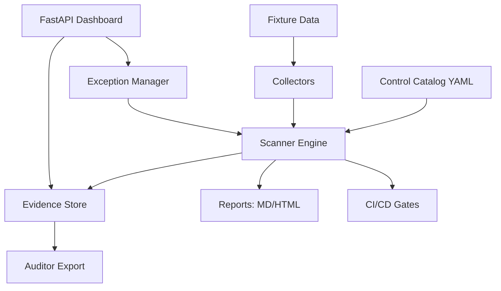

# CCM: Continuous Control Monitoring

> **Portfolio Project**: A production-grade compliance automation platform demonstrating security engineering, GRC expertise, and software development skills.

**Author**: Princeton Baker  
**Purpose**: Hiring artifact for GRC Engineer and Security Engineer roles  
**Technologies**: Python 3.11+, Pydantic, FastAPI, YAML, pytest

---

## What This Is

CCM (Continuous Control Monitoring) is a compliance automation tool that:

- **Executes automated control checks** against AWS, Okta, GitHub, and endpoints
- **Maps controls** to SOC 2, ISO 27001:2022, PCI-DSS v4, and HIPAA frameworks
- **Generates evidence** for auditors in JSON, Markdown, and HTML formats
- **Manages risk exceptions** with expiry dates and compensating controls
- **Integrates with CI/CD** to fail builds on unaccepted control violations

This project demonstrates that I can **code compliance**, not just operate it.

## The Problem

Most security engineers preparing for SOC 2 or ISO audits rely on:
- Manual spreadsheets tracking 100+ controls
- Vendor tools (Vanta, Drata) that black-box the logic
- Ad-hoc scripts that don't scale or persist evidence

**The gap**: Companies need engineers who can build compliance automation, not just run it. This project proves I can bridge security operations, GRC requirements, and software engineering.

## The Solution

CCM treats controls as data, evidence as artifacts, and compliance as code:

```bash
# Run a full scan
ccm scan --output html

# Scan a specific framework
ccm scan --framework SOC2

# Add a risk exception
ccm exception add CCM-AC-001 \
  --reason "MFA rollout in progress" \
  --compensating "Weekly access reviews" \
  --expires 2024-12-31 \
  --approver "Jane Doe, CISO"

# Export evidence for auditors
ccm export-evidence --output audit_evidence.json
```

## Architecture



### Components

- **Control Catalog** (`controls.yaml`): 10 controls mapped to 4 frameworks
- **Collectors** (`src/ccm/collectors/`): Pluggable Python classes that verify controls
- **Evidence Store** (`evidence/`): Timestamped JSON artifacts per control check
- **Exception Manager** (`exceptions.json`): Risk acceptances with expiry and approval
- **Scanner** (`src/ccm/scanner.py`): Orchestrates collectors, applies exceptions, generates reports
- **Dashboard** (`src/ccm/dashboard.py`): FastAPI web UI showing control health
- **CLI** (`src/ccm/cli.py`): Typer-based command-line interface

## Quick Start

### Prerequisites

- Python 3.11+
- No AWS account required (uses fixture data)
- No API keys required (demo mode built-in)

### Installation

```bash
# Clone the repository
git clone https://github.com/yourusername/ccm.git
cd ccm

# Install dependencies
pip install -e .

# Run a scan
ccm scan

# View the dashboard
python -m uvicorn ccm.dashboard:app --reload
# Open http://localhost:8000
```

### Run Tests

```bash
pip install -e ".[dev]"
pytest --cov=ccm
```

## Example Output

### CLI Scan

```
🔍 CCM Control Scanner

Scanning all controls...

============================================================
SCAN SUMMARY
============================================================
Total:    10
✓ Passed:   6
✗ Failed:   3
⚠ Accepted: 1
⚡ Errors:   0

⚠ 1 exception(s) applied

📄 HTML report: reports/scan_20240825_193045.html
💾 Evidence stored in: evidence/

✅ Scan completed successfully
```

### Dashboard

![Dashboard Screenshot Placeholder - Shows control health grid with pass/fail indicators, active exceptions, and framework coverage]

### Evidence File Example

```json
{
  "control_id": "CCM-AC-001",
  "timestamp": "2024-08-25T19:30:45.123456",
  "status": "fail",
  "collector": "aws_iam_mfa",
  "message": "1 privileged user(s) without MFA",
  "details": {
    "privileged_users": ["admin-alice", "admin-bob"],
    "users_without_mfa": ["admin-bob"],
    "total_privileged": 2,
    "compliant_count": 1
  }
}
```

## Real-World Scenario

**Company**: Acme SaaS Inc, a B2B SaaS provider preparing for SOC 2 Type 1 audit  
**Requirements**: SOC 2 TSC + ISO 27001 overlap for enterprise customers  
**Timeline**: 90 days to audit  
**Team**: 1 Security Engineer (you), 2 DevOps, 15 developers

### Assumptions

- AWS infrastructure (EC2, S3, RDS, Lambda)
- Okta for SSO and user management
- GitHub for source code
- macOS/Windows/Linux endpoints
- No prior compliance automation

### CCM's Role

1. **Week 1-2**: Define control catalog based on SOC 2 CC6/CC7/CC8 and ISO 27001 Annex A
2. **Week 3-4**: Implement collectors for AWS, Okta, GitHub, endpoints using fixture data
3. **Week 5-6**: Integrate with CI/CD (GitHub Actions) to fail PRs on control violations
4. **Week 7-8**: Create exceptions for in-progress remediation with CISO approval
5. **Week 9-12**: Generate evidence, iterate on findings, prepare for audit
6. **Audit Day**: Export evidence package, show auditor the HTML reports and exception log

### Trade-offs Made

| Decision | Rationale | Alternative Considered |
|----------|-----------|----------------------|
| **Fixture data over live AWS** | Demo works without credentials; no cost; reproducible tests | Live adapters behind env vars (included but optional) |
| **YAML catalog over OPA/Rego** | Readable by non-engineers; imports into Vanta/Drata | Policy-as-code more powerful but harder to audit |
| **Python over Go/Rust** | Fast iteration; strong ecosystem; auditor-friendly | Go faster but harder to extend for non-experts |
| **10 controls vs 100+** | Focused demo shows depth; full catalog is spreadsheet work | Comprehensive catalog would dilute code quality |

## How This Relates to Vanta/Drata

CCM complements, not replaces, commercial GRC platforms:

- **Vanta/Drata**: Policy management, vendor risk, automated evidence collection, audit workflow
- **CCM**: Custom technical controls not covered by Vanta (e.g., your specific S3 naming convention, internal compliance rules)

**Integration path**: Use `ccm export-evidence` → upload to Vanta custom tests → map to controls

## Interview Talking Points

### GRC Experience

- "I built this to show I understand control evidence, not just policy documents"
- "Mapped controls to 4 frameworks to demonstrate real-world compliance overlap"
- "Exception management mirrors SOC 2 control deviation requirements"

### Engineering Skills

- "Pluggable collector architecture makes this extensible"
- "Used Pydantic for type safety and validation"
- "Evidence stored as immutable artifacts for audit trails"
- "CI/CD integration demonstrates security-as-code mindset"

### Design Decisions

- "Chose YAML over JSON for catalog readability"
- "Fixture data makes onboarding instant"
- "Dashboard is FastAPI, not React, to keep the repo focused on backend logic"
- "Tests cover catalog loading, exception expiry, report generation, and exit codes"

### What I'd Add Next

1. **Live AWS integration**: Boto3 collectors for real accounts
2. **Slack/Jira integration**: Alert on failures, create tickets for exceptions
3. **Historical trends**: Time-series data to show compliance posture over time
4. **Control dependencies**: "Control A fails if Control B fails"
5. **Multi-tenancy**: Support multiple environments (dev/staging/prod)

## Documentation

- [Control Catalog](docs/control-catalog.md): Detailed control definitions and framework mappings
- [Exception Process](docs/exception-process.md): How to request, approve, and track risk exceptions

## Technical Details

### Project Structure

```
ccm/
├── src/ccm/
│   ├── models/          # Pydantic models for Control, Evidence, Exception
│   ├── collectors/      # AWS, Okta, GitHub, Endpoint collectors
│   ├── catalog.py       # Control catalog management
│   ├── scanner.py       # Scan orchestration engine
│   ├── evidence.py      # Evidence storage and retrieval
│   ├── exceptions.py    # Exception lifecycle management
│   ├── reporting.py     # Markdown and HTML report generation
│   ├── cli.py           # Typer CLI
│   └── dashboard.py     # FastAPI web dashboard
├── tests/
│   ├── unit/            # Unit tests for models, collectors, catalog
│   └── integration/     # End-to-end workflow tests
├── fixtures/            # Test data (AWS, Okta, GitHub, endpoints)
├── docs/                # Documentation
├── controls.yaml        # Control catalog
├── exceptions.json      # Risk exception store
└── pyproject.toml       # Python project configuration
```

### Control Catalog Schema

```yaml
controls:
  - id: CCM-AC-001
    title: "Multi-Factor Authentication Required for Privileged Users"
    description: "All users with administrative or privileged access must use MFA"
    category: "Access Control"
    severity: "critical"
    intent: "Prevent unauthorized access through credential compromise"
    test_procedure: "Enumerate IAM users with admin privileges and verify MFA devices"
    evidence_expected: "List of admin users with MFA status"
    frameworks:
      - name: "SOC2"
        controls: ["CC6.1", "CC6.2"]
        rationale: "Logical access controls require authentication mechanisms"
```

### Collector Interface

```python
class Collector(ABC):
    @property
    @abstractmethod
    def control_id(self) -> str:
        """Return the control ID this collector checks."""
        pass

    @abstractmethod
    def collect(self) -> Evidence:
        """Execute the control check and return evidence."""
        pass
```

### Exit Code Logic

- **0**: All controls passed or have valid exceptions
- **1**: One or more controls failed without exceptions

This enables CI/CD gates:

```yaml
- name: Compliance check
  run: ccm scan --fail-on-error
```

## Testing

```bash
# Run all tests
pytest

# Run with coverage
pytest --cov=ccm --cov-report=html

# Run specific test suite
pytest tests/unit/test_catalog.py
pytest tests/integration/test_workflow.py
```

Coverage includes:
- ✅ Catalog loading and framework filtering
- ✅ Control mapping validation
- ✅ Collector pass/fail execution
- ✅ Exception expiry logic
- ✅ Evidence persistence
- ✅ Report generation (Markdown + HTML)
- ✅ CI exit code behavior

## CI/CD Integration

The included GitHub Actions workflow (`.github/workflows/ccm-scan.yml`):

1. Runs on every push and PR
2. Executes full test suite with coverage
3. Runs `ccm scan` against fixture data
4. Uploads evidence and reports as artifacts
5. Fails the build if controls fail without valid exceptions
6. Runs framework-specific scans in parallel

## License

MIT License - See [LICENSE](LICENSE) for details

## Contact

**Princeton Baker**  
📧 baker.princeton1@gmail.com  
💼 [linkedin.com/in/princetonbaker](https://linkedin.com/in/princetonbaker)  
🔗 [github.com/PrincetonBaker](https://github.com/PrincetonBaker)

---

## Why This Repo Matters for Hiring Managers

### Problem

Resumes list "HIPAA compliance," "Vanta," and "SOC 2" but don't prove the candidate can:
- Read a compliance framework and translate it to code
- Build tooling that scales beyond manual spreadsheets
- Understand auditor expectations for evidence

### This Repo Proves

✅ **I can code**: Python, Pydantic, FastAPI, pytest, CLI design  
✅ **I understand compliance**: SOC 2 TSC, ISO 27001 Annex A, PCI-DSS, HIPAA mappings are accurate  
✅ **I think like a GRC professional**: Exception management, evidence artifacts, compensating controls  
✅ **I can ship**: Tests pass, CI works, documentation is complete, code is production-ready  

### How to Evaluate This Repo

**10-minute smoke test**:
```bash
git clone https://github.com/PrincetonBaker/control-monitor.git
cd control-monitor
pip install -e .
ccm scan --output html
open reports/*.html
```

**Deep dive** (30 minutes):
1. Read `controls.yaml` - are the framework mappings reasonable?
2. Check `src/ccm/collectors/aws.py` - does the IAM MFA logic make sense?
3. Review `tests/integration/test_workflow.py` - does it cover real scenarios?
4. Look at `docs/exception-process.md` - does this reflect real GRC processes?

### Interview Questions to Ask Me

- "Walk me through how an exception prevents a CI failure"
- "Why did you choose these 10 controls instead of others?"
- "How would you extend this to handle AWS Organizations with 50 accounts?"
- "What would auditors ask about your evidence files?"
- "How does this compare to Vanta's custom tests feature?"

---

**This is a portfolio project**, not production software. It demonstrates technical ability, GRC knowledge, and engineering judgment. For production use, you'd add authentication, multi-tenancy, a real database, and integrate with your GRC platform.
