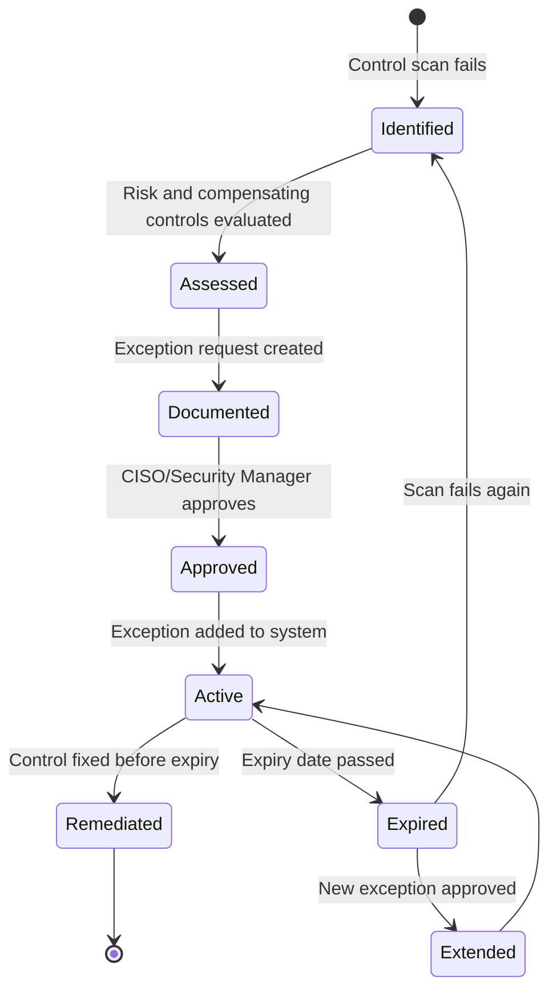

# Risk Exception Process Guide

This document describes the formal risk acceptance process for CCM, including when to use exceptions, how to document them, and best practices for compensating controls.

---

## When to Use Risk Exceptions

Risk exceptions are **temporary acceptance of control failures** when:

1. **Technical Remediation Delayed** - Control gap exists but fix is scheduled
2. **Business Justification** - Cost/impact of immediate fix outweighs risk
3. **Compensating Controls in Place** - Alternative controls reduce risk to acceptable level
4. **Legacy System Migration** - Old system being replaced within defined timeframe

### When NOT to Use Exceptions

- **Permanent control gaps** - These should be addressed or removed from scope
- **Critical vulnerabilities** - Actively exploited or high-likelihood threats
- **Regulatory requirements** - Cannot be excepted (e.g., PCI-DSS data encryption)
- **No compensating controls** - Risk remains unmitigated

---

## Exception Workflow

### 1. Identify Control Failure

```bash
ccm scan --control CCM-002 --output console
```

**Output:**
```
❌ FAIL - CCM-002: Data Encryption at Rest
Details: Found 4 buckets, 1 without encryption
Severity: CRITICAL
```

### 2. Assess Risk and Compensating Controls

**Questions to answer:**
- What is the business impact of this failure?
- What is the likelihood of exploitation?
- What compensating controls are in place?
- When can this be remediated?
- Who needs to approve this exception?

**Example Assessment:**

```
Control: CCM-002 (S3 Encryption)
Failed Resource: s3://legacy-backups
Risk: Medium (bucket contains old test data, no PII/PHI)
Compensating Controls:
  - Bucket has restrictive IAM policy (only 2 admin users)
  - VPC endpoint access only (no public internet)
  - Bucket versioning enabled with 30-day retention
Remediation Plan: Migrate to encrypted bucket by 2026-12-31
```

### 3. Document Exception

```bash
ccm exception add \
  --control CCM-002 \
  --reason "Legacy S3 bucket scheduled for migration to encrypted bucket by 2026-12-31. Contains only historical test data (no PII/PHI)." \
  --compensating "Bucket has restrictive IAM policy (2 admin users only), VPC endpoint access only (no internet), and versioning enabled with 30-day retention." \
  --expiry 2026-12-31 \
  --approver "Jane Doe, CISO (jane.doe@example.com)"
```

### 4. Review and Approval

**Approval Matrix:**

| Severity | Approver | Documentation Required |
|----------|----------|------------------------|
| Critical | CISO + Board | Written business justification, compensating controls, remediation plan |
| High | CISO | Compensating controls, remediation plan |
| Medium | Security Manager | Compensating controls, remediation timeline |
| Low | Security Engineer | Justification and timeline |

### 5. Track and Monitor

```bash
# List all active exceptions
ccm exception list

# Include expired exceptions
ccm exception list --show-expired
```

### 6. Expiry and Re-enforcement

**On expiry date:**
- Exception automatically becomes invalid
- Control scan shows FAIL status again
- CI/CD builds fail if critical/high severity

```bash
# After 2026-12-31, scan shows:
ccm scan --control CCM-002 --output console

❌ FAIL - CCM-002: Data Encryption at Rest
Details: Found 4 buckets, 1 without encryption
Severity: CRITICAL
```

---

## Compensating Controls

A **compensating control** is an alternative security measure that reduces risk when the primary control cannot be implemented.

### Effective Compensating Controls

#### Access Restrictions
**Primary Control:** S3 bucket encryption  
**Compensating Control:**
- Restrictive IAM policy (specific users/roles only)
- VPC endpoint access (no public internet)
- SCPs preventing public access at organization level

#### Enhanced Monitoring
**Primary Control:** MFA for all users  
**Compensating Control:**
- Real-time alerting on privileged actions
- Session recording and review
- Geo-fencing (block logins from unexpected locations)

#### Network Segmentation
**Primary Control:** Endpoint disk encryption  
**Compensating Control:**
- Device limited to corporate network only
- No access to sensitive data stores
- Enhanced EDR monitoring

#### Administrative Procedures
**Primary Control:** Automated access reviews  
**Compensating Control:**
- Manual quarterly access reviews
- Manager attestation required
- Privileged access recertification monthly

### Insufficient Compensating Controls

❌ **"We have a firewall"** - Too vague, not specific to the risk  
❌ **"We'll be careful"** - Not a technical control  
❌ **"Low risk of exploitation"** - Risk assessment is not a control  
❌ **"Only trusted employees have access"** - Insider threat still exists  

---

## Exception Template

Use this template when documenting exceptions outside of the CLI:

```markdown
## Risk Exception Request

**Control ID:** CCM-XXX  
**Control Title:** [Control Name]  
**Severity:** [Critical/High/Medium/Low]

### Failure Description
[Describe what is failing and why]

### Business Justification
[Why can't this be fixed immediately? Cost, timeline, technical constraints]

### Risk Assessment
**Impact:** [Low/Medium/High]  
**Likelihood:** [Low/Medium/High]  
**Overall Risk:** [Low/Medium/High]

[Detailed risk explanation]

### Compensating Controls
1. [Control 1 with implementation details]
2. [Control 2 with implementation details]
3. [Control 3 with implementation details]

### Remediation Plan
**Target Date:** YYYY-MM-DD  
**Owner:** [Name, Title]  
**Steps:**
1. [Step 1]
2. [Step 2]
3. [Step 3]

### Approval
**Requested By:** [Name, Title, Date]  
**Approved By:** [Name, Title, Date]  
**Review Date:** [Quarterly/Monthly]
```

---

## Best Practices

### 1. Time-Box Exceptions

✅ **Do:**
```bash
# Set realistic but firm expiry dates
--expiry 2026-12-31  # 4 months for migration project
```

❌ **Don't:**
```bash
# Indefinite or multi-year exceptions
--expiry 2030-12-31  # Too far out, becomes permanent
```

### 2. Document Compensating Controls Specifically

✅ **Do:**
```
"VPC endpoint sg-0123abcd restricts access to 10.0.0.0/8 corporate network. 
CloudTrail logs all bucket access with alerts to #security-alerts Slack channel. 
S3 Object Lock prevents deletion for 90 days."
```

❌ **Don't:**
```
"We have security controls in place to monitor this."
```

### 3. Include Remediation Plans

✅ **Do:**
```
"Scheduled migration to encrypted bucket:
- Week 1: Create new encrypted bucket with KMS key
- Week 2: Copy data with aws s3 sync
- Week 3: Update application configs to new bucket
- Week 4: Validate and decommission old bucket"
```

❌ **Don't:**
```
"We'll fix this eventually."
```

### 4. Review Exceptions Regularly

```bash
# Monthly security meeting agenda item
ccm exception list --show-expired

# Check for exceptions expiring soon
ccm exception list | grep "2026-09"  # Expiring next month
```

### 5. Track Exception Metrics

**Key Metrics:**
- Total active exceptions by severity
- Average exception duration
- Exception expiry compliance (% closed on time)
- Repeat exceptions (same control excepted multiple times)

---

## Exception Lifecycle



---

## Auditor Review

### What Auditors Look For

1. **Formal Process** - Documented exception workflow with approval matrix
2. **Specific Compensating Controls** - Technical controls, not just promises
3. **Time-Bound** - Exceptions have clear expiry dates
4. **Executive Approval** - Critical/high exceptions approved by CISO or above
5. **Tracking** - Exceptions tracked in system with evidence of remediation

### Presenting Exceptions to Auditors

```bash
# Generate report showing all exceptions
ccm scan --output html --output-file audit-report.html

# Export exception list to share
ccm exception list > exceptions-for-audit.txt
```

**In audit report:**
- Show exception ID and approval chain
- Include compensating control details
- Reference remediation project timeline
- Provide evidence of monitoring (CloudTrail logs, alerts)

### Sample Audit Response

**Auditor Finding:** "CCM-002 shows 1 S3 bucket without encryption (CC6.7 requirement)."

**Your Response:**
```
This finding is covered by Risk Exception EX-a1b2c3d4:

Control: CCM-002
Status: Excepted until 2026-12-31
Reason: Legacy test data bucket scheduled for migration
Compensating Controls:
  - Restrictive IAM policy (2 admin users only)
  - VPC endpoint access (no internet routing)
  - S3 versioning with 30-day retention
Approver: Jane Doe, CISO (approved 2026-08-15)
Remediation: Migration project tracked in JIRA-SEC-1234

Supporting Evidence:
  - Exception approval email (Attachment A)
  - IAM policy document (Attachment B)
  - VPC endpoint configuration (Attachment C)
  - JIRA migration project (Attachment D)
```

---

## Automation

### Scheduled Exception Review

```yaml
# .github/workflows/exception-review.yml
name: Exception Review
on:
  schedule:
    - cron: '0 9 1 * *'  # First day of month at 9 AM

jobs:
  review:
    runs-on: ubuntu-latest
    steps:
      - uses: actions/checkout@v4
      - name: Check expiring exceptions
        run: |
          ccm exception list --show-expired
          # Post to Slack, create JIRA tickets, etc.
```

### Exception Expiry Alerts

```python
# scripts/check_expiring_exceptions.py
from datetime import datetime, timedelta
from ccm.exceptions import ExceptionManager

manager = ExceptionManager("exceptions.json")

# Find exceptions expiring in next 30 days
expiring_soon = []
cutoff = datetime.utcnow() + timedelta(days=30)

for exc in manager.list_valid():
    if exc.expiry_date < cutoff:
        expiring_soon.append(exc)

if expiring_soon:
    print(f"⚠️  {len(expiring_soon)} exceptions expiring in next 30 days:")
    for exc in expiring_soon:
        days_left = (exc.expiry_date - datetime.utcnow()).days
        print(f"  - {exc.control_id}: {days_left} days left")
```

---

## Common Exception Scenarios

### Scenario 1: Cloud Migration in Progress

**Control:** CCM-010 (Endpoint Disk Encryption)  
**Failure:** 50 contractor laptops without disk encryption  
**Exception:**
```bash
ccm exception add \
  --control CCM-010 \
  --reason "Contract developer laptops being migrated to MDM by Q4 2026. Currently 50 devices pending enrollment." \
  --compensating "Devices restricted to guest WiFi only (no VPN access). No production data access. Enhanced EDR monitoring via CrowdStrike. Remote wipe enabled." \
  --expiry 2026-12-31 \
  --approver "Security Manager, Chris Lee"
```

### Scenario 2: Legacy System Retirement

**Control:** CCM-013 (Password Policy)  
**Failure:** Legacy app doesn't support 12-char passwords  
**Exception:**
```bash
ccm exception add \
  --control CCM-013 \
  --reason "Legacy invoicing app (v2.1) maxes out at 8-char passwords. App being replaced by Workday Financials in Q1 2027." \
  --compensating "App network-isolated (VPN-only access). Session timeout 15 minutes. All actions logged to Splunk. MFA required at VPN layer." \
  --expiry 2027-03-31 \
  --approver "CISO, Jane Doe"
```

### Scenario 3: Third-Party Vendor Gap

**Control:** CCM-015 (Vendor Security Assessment)  
**Failure:** Vendor SOC 2 report expired 3 months ago  
**Exception:**
```bash
ccm exception add \
  --control CCM-015 \
  --reason "Vendor (Acme Analytics) SOC 2 Type 2 report expired 2026-06-01. New report expected by 2026-10-01 per vendor contract." \
  --compensating "Vendor processes only aggregated/anonymized data (no PII). Data encrypted in transit (TLS 1.3) and at rest (AES-256). Vendor pentested 2026-07-15 with zero critical/high findings." \
  --expiry 2026-10-31 \
  --approver "CISO, Jane Doe"
```

---

## Metrics Dashboard

Track exception health with these metrics:

```python
from ccm.exceptions import ExceptionManager

manager = ExceptionManager("exceptions.json")

# Total exceptions by status
total = len(manager.list_all())
valid = len(manager.list_valid())
expired = len(manager.list_expired())

print(f"Exceptions: {total} total, {valid} valid, {expired} expired")

# Exceptions by control
from collections import Counter
control_counts = Counter(exc.control_id for exc in manager.list_valid())
print("Top 5 excepted controls:")
for control_id, count in control_counts.most_common(5):
    print(f"  {control_id}: {count} exceptions")
```

**Target Thresholds:**
- **Total Exceptions:** < 10% of total controls
- **Expired Exceptions:** 0 (all resolved or extended)
- **Average Duration:** < 90 days
- **Critical Exception:** < 2 active at any time

---

## Conclusion

Risk exceptions are a **necessary part of pragmatic security**, but they must be:

1. **Time-bound** - Clear expiry dates with remediation plans
2. **Approved** - Executive sign-off based on severity
3. **Compensated** - Alternative controls reduce risk
4. **Tracked** - System of record with audit trail
5. **Reviewed** - Regular check-ins on remediation progress

**Remember:** An exception is not a permanent solution. It's a commitment to fix the gap within a defined timeframe.

---

## Resources

- [NIST SP 800-53 Compensating Controls](https://csrc.nist.gov/publications/detail/sp/800-53/rev-5/final)
- [PCI-DSS Compensating Controls Worksheet](https://www.pcisecuritystandards.org/document_library)
- [SOC 2 Exception Management Best Practices](https://www.aicpa.org/interestareas/frc/assuranceadvisoryservices/aicpasoc2report)

---

**For questions or support:**  
Princeton Baker - [baker.princeton1@gmail.com](mailto:baker.princeton1@gmail.com)
